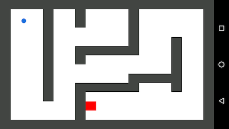
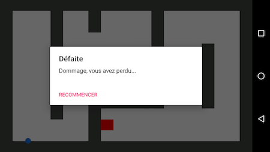

# Sensor Maze

Je de labyrinthe sur Android utilisant les capteurs de l'appareil !

## Installation
- Installer Android Studio (version 2.3+ recommandée).
- Cloner le projet `git clone https://github.com/Gramatiik/sensor-maze.git`.
- Ouvrir le projet sur Android Studio et installer les dépendances (voir la section Compatibilité).
- Profitez !

## Compatibilité
| Min SDK | Target SDK | Compile SDK | Android Studio |
|:-------:|:----------:|:-----------:|:--------------:|
|21       |26          |26           |2.3.3           |

Fonctionne sur mobiles et tablettes, la tuile s'adapte à la taille de l'écran.

## Fonctionnalités

- Déplacez la boule à l'aide de l'accéléromètre de l'appareil.
- La boule change de couleur en fonction du magnétisme ambiant.
- Le fond du labyrinthe change en fonction de la luminosité.

## Captures d'écran

  

## TODO et idées
- Ajouter un menu principal.
- Permettre de choisir son niveau.
- Possibilité de créer ses niveaux.
- Page d'options :
    - Taille de la boule.
    - Accélération de la boule.
    - Vitesse de la boule.
    
## Licence

[MIT](LICENCE.md)